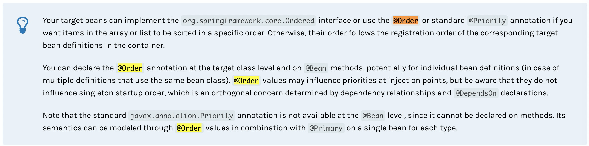
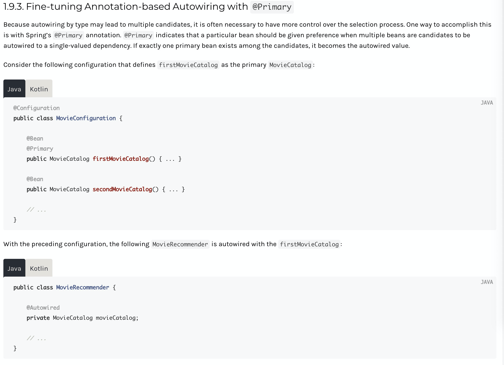
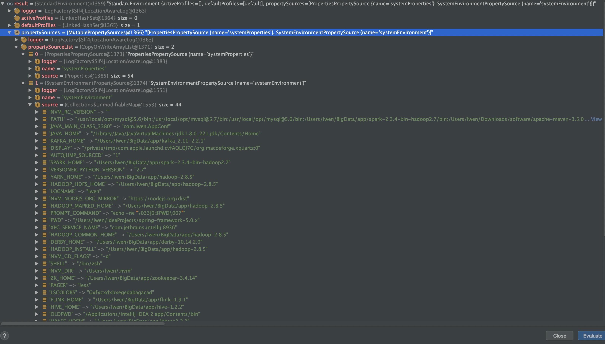
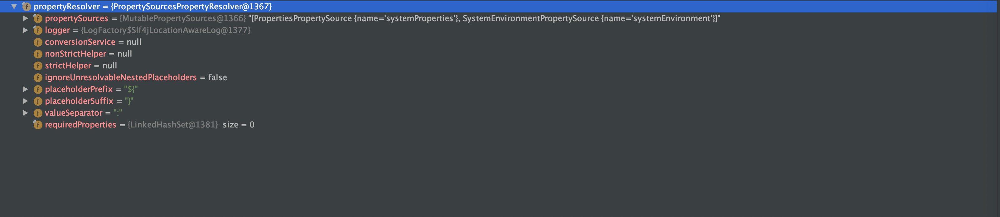

## Spring 源码分析 - IOC （一）

## 一、IOC 启动概览

整个调试过程基于注解驱动的 Spring Freamwork 5.x 源码

整个启动大致的流程可以分为设置 `bean 工厂`，`注册 beanDefinitions` ，`启动容器` 三部分。

```java
public AnnotationConfigApplicationContext(Class<?>... annotatedClasses) {
   /*
      调用无参的构造方法,无参的构造方法会调用父类的无参构造方法 主要的工作是 this.beanFactory = new DefaultListableBeanFactory();
      也就是创建 bean 工厂
    */
   this();
   /*
      主要工作为注册我们的主类，也就是我们传递进来的 Class，以及注册一些 Spring 的核心功能类到 beanDefinitions 中
    */
   register(annotatedClasses);
   /*
      核心的方法，启动容器
    */
   refresh();
}
```

## 二、this 调用


> 看一下在 Spring Doc 中对 @Order 和 @Primary 的说明
>
> 
>
> 

获取环境，如果非 Web 情况下默认就是 StandardEnvironment

```java
/**
 * Get the Environment from the given registry if possible, otherwise return a new
 * StandardEnvironment.
 * 这个环境说的是一般为 servlet eg: StandardServletEnvironment 或者是 non web eg: StandardEnvironment
 */
private static Environment getOrCreateEnvironment(BeanDefinitionRegistry registry) {
   Assert.notNull(registry, "BeanDefinitionRegistry must not be null");
   if (registry instanceof EnvironmentCapable) {
      return ((EnvironmentCapable) registry).getEnvironment();
   }
   return new StandardEnvironment();
}
```

这个 Env 中包含了系统变量和Java 的环境变量，上面是java 系统变量，下面是环境变量：



另外就是属性解析器：



