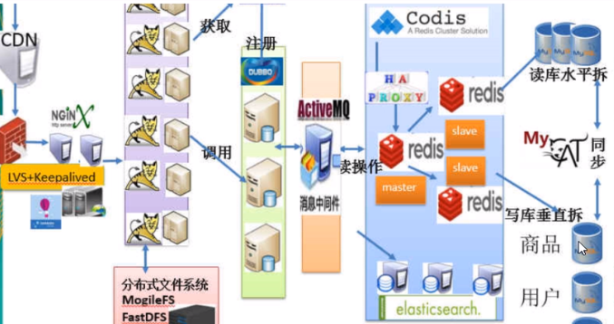
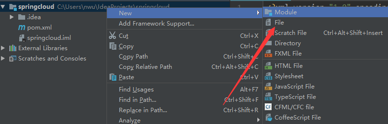

# SpringCloud：基础

SpringCloud 是微服务架构的一个实现框架，说他是一个框架更不如说他是一个生态，他包含了很多个技术，将这些技术组合起来形成我们的微服务架构应用。


## 1.SpringCloud vs Dubbo


**最大区别：SpringCloud抛弃了Dubbo的RPC通信，采用的是基于HTTP的REST方式。**
	严格来说，这两种方式各有优劣。虽然从一定程度上来说，后者牺牲了服务调用的性能，但也避免了上面提到的原生RPC带来的问题。而且REST相比RPC更为灵活，服务提供方和调用方的依赖只依靠一纸契约，不存在代码级别的强依赖，这在强调快速演化的微服务环境下，显得更加合适。
	很明显，Spring Cloud的功能比DUBBO更加强大，涵盖面更广，而且作为Spring的拳头项目，它也能够与Spring Framework、Spring Boot、Spring Data、Spring Batch等其他Spring项目完美融合，这些对于微服务而言是至关重要的。使用Dubbo构建的微服务架构就像组装电脑，各环节我们的选择自由度很高，但是最终结果很有可能因为一条内存质量不行就点不亮了，总是让人不怎么放心，但是如果你是一名高手，那这些都不是问题；而Spring Cloud就像品牌机，在Spring Source的整合下，做了大量的兼容性测试，保证了机器拥有更高的稳定性，但是如果要在使用非原装组件外的东西，就需要对其基础有足够的了解。

## 2.微服务搭建实例

我们准备了四个模块，然后这四个模块分别就是用来做统一项目管理的 `parent` 、一个公共的 `api` 比如通用的实体类 、一个服务提供者和一个服务消费者。

这样我们形成了一个简单的微服务架构的程序了，接下来就是一步一步的搭建这个框架，这里采用的是 Idea 来搭建项目。

### 1.创建parent工程

首先我们创建一个Maven项目，注意一点的就是再生成这个项目的时候我们的打包方式要选择 pom 而不是 jar 或者 war，然后这个项目会自动生成一堆的文件夹，其实我们只需要这个 pom 文件，因为只需要做版本控制，而不用写代码的地方。那么我们就删除那些 java 、test 文件夹。



那么现在我们的 parent 工程就创建好了，接着就是做一些版本依赖的处理了，我们就需要在pom文件中添加如下的内容。

```xml
<?xml version="1.0" encoding="UTF-8"?>
<project xmlns="http://maven.apache.org/POM/4.0.0"
         xmlns:xsi="http://www.w3.org/2001/XMLSchema-instance"
         xsi:schemaLocation="http://maven.apache.org/POM/4.0.0 http://maven.apache.org/xsd/maven-4.0.0.xsd">
    <modelVersion>4.0.0</modelVersion>

    <groupId>com.lwen</groupId>
    <artifactId>parent</artifactId>
    <packaging>pom</packaging>
    <version>1.0-SNAPSHOT</version>

    <!--我们的子模块-->
    <modules>
        <module>cloud-api</module>
        <module>provider-dept-8001</module>
        <module>consumer-dept-80</module>
    </modules>

    <properties>
        <project.build.sourceEncoding>UTF-8</project.build.sourceEncoding>
        <maven.compiler.source>1.8</maven.compiler.source>
        <maven.compiler.target>1.8</maven.compiler.target>
        <junit.version>4.12</junit.version>
        <log4j.version>1.2.17</log4j.version>
        <lombok.version>1.16.18</lombok.version>
    </properties>

    <dependencyManagement>
        <dependencies>
            <dependency>
                <groupId>org.springframework.cloud</groupId>
                <artifactId>spring-cloud-dependencies</artifactId>
                <version>Dalston.SR1</version>
                <type>pom</type>
                <scope>import</scope>
            </dependency>
            <dependency>
                <groupId>org.springframework.boot</groupId>
                <artifactId>spring-boot-dependencies</artifactId>
                <version>1.5.9.RELEASE</version>
                <type>pom</type>
                <scope>import</scope>
            </dependency>
            <dependency>
                <groupId>mysql</groupId>
                <artifactId>mysql-connector-java</artifactId>
                <version>5.0.4</version>
            </dependency>
            <dependency>
                <groupId>com.alibaba</groupId>
                <artifactId>druid</artifactId>
                <version>1.0.31</version>
            </dependency>
            <dependency>
                <groupId>org.mybatis.spring.boot</groupId>
                <artifactId>mybatis-spring-boot-starter</artifactId>
                <version>1.3.0</version>
            </dependency>
            <dependency>
                <groupId>ch.qos.logback</groupId>
                <artifactId>logback-core</artifactId>
                <version>1.2.3</version>
            </dependency>
            <dependency>
                <groupId>junit</groupId>
                <artifactId>junit</artifactId>
                <version>${junit.version}</version>
                <scope>test</scope>
            </dependency>
            <dependency>
                <groupId>log4j</groupId>
                <artifactId>log4j</artifactId>
                <version>${log4j.version}</version>
            </dependency>
        </dependencies>
    </dependencyManagement>

    <build>
        <finalName>microservicecloud</finalName>
        <resources>
            <resource>
                <directory>src/main/resources</directory>
                <filtering>true</filtering>
            </resource>
        </resources>
        <plugins>
            <plugin>
                <groupId>org.apache.maven.plugins</groupId>
                <artifactId>maven-resources-plugin</artifactId>
                <configuration>
                    <delimiters>
                        <delimit>$</delimit>
                    </delimiters>
                </configuration>
            </plugin>
        </plugins>
    </build>
</project>
```

注意一点的就是因为我这个pom文件是所有工程都创建好的工程的 pom 所以说这里我的 子模块 是后来加上去的，可以直接删了后面真的在创建子模块的时候会自动生成这些东西。

## 2.创建公共的api

接着我们在我们创建好的 **parent 工程上** 右键创建一个新的 `module` 然后我们项目结构还是选择 `Maven` 注意一点的就是我们在创建项目的时候可以选择父工程，我们在这里就选择我们创建好的 parent 工程。




那么生成好的项目就会有这么一段文字：

```xml
<parent>
    <artifactId>parent</artifactId>
    <groupId>com.lwen</groupId>
    <version>1.0-SNAPSHOT</version>
</parent>
```

然后我们在里面加一些我们常用的依赖以后，我们的pom就会长成这个样子：

```xml
<?xml version="1.0" encoding="UTF-8"?>
<project xmlns="http://maven.apache.org/POM/4.0.0"
         xmlns:xsi="http://www.w3.org/2001/XMLSchema-instance"
         xsi:schemaLocation="http://maven.apache.org/POM/4.0.0 http://maven.apache.org/xsd/maven-4.0.0.xsd">
    <parent>
        <artifactId>parent</artifactId>
        <groupId>com.lwen</groupId>
        <version>1.0-SNAPSHOT</version>
    </parent>
    <modelVersion>4.0.0</modelVersion>

    <artifactId>cloud-api</artifactId>

    <dependencies><!-- 当前Module需要用到的jar包，按自己需求添加，如果父类已经包含了，可以不用写版本号 -->
        <dependency>
            <groupId>org.projectlombok</groupId>
            <artifactId>lombok</artifactId>
        </dependency>
        <dependency>
            <groupId>org.springframework.cloud</groupId>
            <artifactId>spring-cloud-starter-feign</artifactId>
        </dependency>
    </dependencies>
</project>
```

好的，现在我们的基础配置已经配置好了，就可以在 api 中写代码了。我们这里需要共享的 api 其实就是我们的实体类，实际上还有很多，这里我们就仅仅拿实体类做例子。

创建一个 entries 包 然后创建一个实体类：

```java
package entries;


import lombok.AllArgsConstructor;
import lombok.Data;
import lombok.NoArgsConstructor;
import lombok.experimental.Accessors;

import java.io.Serializable;

@NoArgsConstructor
@AllArgsConstructor
@Data
@Accessors(chain = true)
//必须实现序列化接口
public class Dept implements Serializable {
    private Long deptno;
    private String dname;
    private String db_source;
}
```

由于我们上面添加了 `小辣椒` 的依赖，这里的实体类非常简单。


这步完成了就应该是这样的一个结构，然后我们就可以开始生产者的创建了。

## 3.生产者

生产者里面其实我们应该包含一个完整的 web 层，也就是说我们需要有完整的 Controller 、Service、Dao 然后我们的Controller是用来给后面的消费者调用的，因为我们的SpringCloud是基于Rest请求的嘛。

同理我们创建一个Maven项目，然后导入父工程，接着就是导入依赖：

### 1.导入依赖

```xml
<?xml version="1.0" encoding="UTF-8"?>
<project xmlns:xsi="http://www.w3.org/2001/XMLSchema-instance"
         xmlns="http://maven.apache.org/POM/4.0.0"
         xsi:schemaLocation="http://maven.apache.org/POM/4.0.0 http://maven.apache.org/xsd/maven-4.0.0.xsd">
    <parent>
        <artifactId>parent</artifactId>
        <groupId>com.lwen</groupId>
        <version>1.0-SNAPSHOT</version>
    </parent>
    <modelVersion>4.0.0</modelVersion>

    <groupId>com.lwen</groupId>
    <artifactId>provider-dept-8001</artifactId>


    <dependencies>
        <!-- 引入自己定义的api通用包，可以使用Dept部门Entity -->
        <dependency>
            <groupId>com.lwen</groupId>
            <artifactId>cloud-api</artifactId>
            <version>${project.version}</version>
        </dependency>

        <dependency>
            <groupId>org.springframework.cloud</groupId>
            <artifactId>spring-cloud-starter-config</artifactId>
        </dependency>
        <dependency>
            <groupId>junit</groupId>
            <artifactId>junit</artifactId>
        </dependency>
        <dependency>
            <groupId>mysql</groupId>
            <artifactId>mysql-connector-java</artifactId>
        </dependency>
        <dependency>
            <groupId>com.alibaba</groupId>
            <artifactId>druid</artifactId>
        </dependency>
        <dependency>
            <groupId>ch.qos.logback</groupId>
            <artifactId>logback-core</artifactId>
        </dependency>
        <dependency>
            <groupId>org.mybatis.spring.boot</groupId>
            <artifactId>mybatis-spring-boot-starter</artifactId>
        </dependency>
        <dependency>
            <groupId>org.springframework.boot</groupId>
            <artifactId>spring-boot-starter-jetty</artifactId>
        </dependency>
        <dependency>
            <groupId>org.springframework.boot</groupId>
            <artifactId>spring-boot-starter-web</artifactId>
        </dependency>
        <dependency>
            <groupId>org.springframework.boot</groupId>
            <artifactId>spring-boot-starter-test</artifactId>
        </dependency>
        <!-- 修改后立即生效，热部署 -->
        <dependency>
            <groupId>org.springframework</groupId>
            <artifactId>springloaded</artifactId>
        </dependency>
        <dependency>
            <groupId>org.springframework.boot</groupId>
            <artifactId>spring-boot-devtools</artifactId>
        </dependency>
    </dependencies>
</project>
```

### 2.配置springboot配置文件

```yaml
server:
  port: 8001

spring:
   application:
    name: cloud-dept
   datasource:
    type: com.alibaba.druid.pool.DruidDataSource            # 当前数据源操作类型
    driver-class-name: org.gjt.mm.mysql.Driver              # mysql驱动包
    url: jdbc:mysql://localhost:3306/cloudDB01              # 数据库名称
    username: root
    password:
    dbcp2:
      min-idle: 5                                           # 数据库连接池的最小维持连接数
      initial-size: 5                                       # 初始化连接数
      max-total: 5                                          # 最大连接数
      max-wait-millis: 200                                  # 等待连接获取的最大超时时间
      
 mybatis:
  configuration:
    map-underscore-to-camel-case: true
```

### 3.dao

```java
package lwen.dao;


import lwen.entries.Dept;
import org.apache.ibatis.annotations.Insert;
import org.apache.ibatis.annotations.Select;

import java.util.List;

public interface DeptDao {
    @Select("select * from clouddb01.dept")
    public List<Dept> findAll();

    @Insert("insert into clouddb01.dept(name, db_name) values (#{name},database())")
    boolean insertDept(Dept dept);
}

```

### 4.Service

```java
package lwen.service;

import lwen.dao.DeptDao;
import lwen.entries.Dept;
import org.springframework.beans.factory.annotation.Autowired;
import org.springframework.stereotype.Service;

import java.util.List;

@Service
public class DeptService {
    @Autowired
    DeptDao deptDao;

    public List<Dept> findAll() {
        return deptDao.findAll();
    }

    public Boolean insertDept(Dept dept) {
        return deptDao.insertDept(dept);
    }
}

```

### 5.controller

```java
package com.lwen.controller;

import entries.Dept;
import org.springframework.beans.factory.annotation.Autowired;
import org.springframework.web.bind.annotation.GetMapping;
import org.springframework.web.bind.annotation.RestController;
import com.lwen.service.DeptService;

import java.util.List;

@RestController
public class DeptController {

    @Autowired
    DeptService deptService;

    @GetMapping("/dep")
    public List<Dept> list() {
        return deptService.list();
    }

    @GetMapping("/dep/add")
    public Integer insert(Dept dept) {
        return deptService.add(dept);
    }
}
```

## 4.消费者

同上创建一个module，完成消费者的编写。

消费者其实只有一个Controller，这是因为我们的真正的业务逻辑都被封装到我们的微服务中去了，所以说不存在后面的Service以及Dao。

### 1.导入依赖

```xml
<?xml version="1.0" encoding="UTF-8"?>
<project xmlns="http://maven.apache.org/POM/4.0.0"
         xmlns:xsi="http://www.w3.org/2001/XMLSchema-instance"
         xsi:schemaLocation="http://maven.apache.org/POM/4.0.0 http://maven.apache.org/xsd/maven-4.0.0.xsd">
    <parent>
        <artifactId>parent</artifactId>
        <groupId>com.lwen</groupId>
        <version>1.0-SNAPSHOT</version>
    </parent>
    <modelVersion>4.0.0</modelVersion>

    <groupId>com.lwen</groupId>
    <artifactId>consumer-dept-80</artifactId>

    <dependencies>
        <dependency><!-- 自己定义的api -->
            <groupId>com.lwen</groupId>
            <artifactId>cloud-api</artifactId>
            <version>${project.version}</version>
        </dependency>
        <!-- Ribbon相关 -->
        <dependency>
            <groupId>org.springframework.cloud</groupId>
            <artifactId>spring-cloud-starter-eureka</artifactId>
        </dependency>
        <dependency>
            <groupId>org.springframework.cloud</groupId>
            <artifactId>spring-cloud-starter-ribbon</artifactId>
        </dependency>
        <dependency>
            <groupId>org.springframework.cloud</groupId>
            <artifactId>spring-cloud-starter-config</artifactId>
        </dependency>
        <dependency>
            <groupId>org.springframework.boot</groupId>
            <artifactId>spring-boot-starter-web</artifactId>
        </dependency>
        <!-- 修改后立即生效，热部署 -->
        <dependency>
            <groupId>org.springframework</groupId>
            <artifactId>springloaded</artifactId>
        </dependency>
        <dependency>
            <groupId>org.springframework.boot</groupId>
            <artifactId>spring-boot-devtools</artifactId>
        </dependency>
    </dependencies>
</project>
```

### 2.配置文件

```yaml
server:
  port: 81
```

### 3.config

```java
package com.lwen.config;

import org.springframework.context.annotation.Bean;
import org.springframework.context.annotation.Configuration;
import org.springframework.web.client.RestTemplate;

@Configuration
public class BeanConfig {

    @Bean
    public RestTemplate restTemplate() {
        return new RestTemplate();
    }
}
```

这个地方我使用了 JavaConfig 配置了一个 RestTemplate 的Bean，然后这个东西其实就是和我们以前接触的 redisTemplate 以及 jdbc的一样，就是一个工具，用来简化操作的。这里就是简化我们的 rest 请求操作，相当于一个 Http 的客户端。

### 4.Controller

```java
package com.lwen.controller;


import entries.Dept;
import org.springframework.beans.factory.annotation.Autowired;
import org.springframework.web.bind.annotation.GetMapping;
import org.springframework.web.bind.annotation.RestController;
import org.springframework.web.client.RestTemplate;

import java.util.List;

@RestController
public class DeptController {

    public static final String PREFIX_URL = "http://localhost:8001/";
    @Autowired
    RestTemplate restTemplate;


    @GetMapping("/list")
    public List list() {
        return restTemplate.getForObject(PREFIX_URL + "dep", List.class);
    }

    @GetMapping("/dep/add")
    public Integer add(Dept dept) {
        return restTemplate.getForObject(PREFIX_URL + "dep/add",Integer.class);
    }
}
```


好，现在我们的项目搭建完毕，目前的目录架构应该是这样的：

